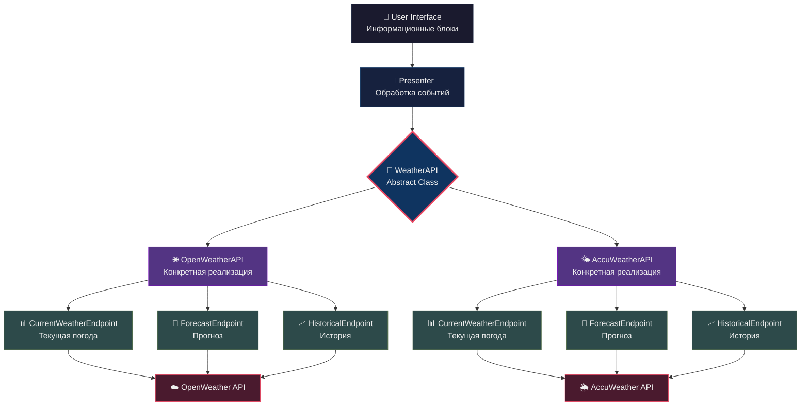

# Offweather app

## Run the app

### Uv package manager

Run as a desktop app:

```bash
uv run flet run
```

Run as a web app:

```bash
uv run flet run --web
```


## Build the app

```bash
flet build apk -v # Android

flet build ipa -v # iOS

flet build macos -v # macOS

flet build linux -v # Linux

flet build windows -v # Windows
```

## Архитектура системы



## Принцип работы

**Пользователь** видит интерфейс с информационными блоками (температура, прогноз, влажность). При клике на блок открывается детальная информация с кнопками обновления и управления данными.

**Presenter** получает события от интерфейса и обращается к WeatherAPI с запросами типа "получить данные о текущей погоде" или "обновить прогноз".

**WeatherAPI** служит центральным контроллером, который знает какие данные запрашивать и у каких endpoints. Он управляет коллекцией различных источников данных.

**Endpoints** — это специализированные модули, каждый из которых умеет получать определенный тип погодных данных. Например, один endpoint получает текущую погоду, другой — прогноз на неделю, третий — исторические данные.

## Поток данных

1. **Пользователь** нажимает на блок "Текущая погода"
2. **Presenter** вызывает `weather_api.get_data("CurrentWeather")`
3. **WeatherAPI** находит нужный endpoint и вызывает его метод `refresh()`
4. **Endpoint** отправляет HTTP запрос к внешнему API
5. **Данные** возвращаются обратно через всю цепочку к интерфейсу

## Гибкость системы

Архитектура позволяет легко добавлять новые типы данных (создать новый endpoint), подключать другие API провайдеры (создать новую реализацию WeatherAPI) и менять интерфейс без влияния на логику получения данных.

Каждый компонент отвечает за одну задачу: Presenter управляет UI, WeatherAPI координирует получение данных, endpoints специализируются на конкретных типах информации.
